  # Waterserver Report App

The Field Monitoring app is developed using Flutter and Dart to track and manage construction processes across different regions. The application enables real-time and offline data collection, ensuring continuous workflow even without an internet connection.

# 📌 Features:

Construction Monitoring: Track and control construction activities across multiple regions.

Offline & Online Mode: Seamless data entry in offline mode with automatic sync when internet is available.

Location Tracking: Capture and store user location during report submission.

Network Detection: Check internet connectivity and adapt app behavior accordingly.

Data Management: Add and manage field reports efficiently.

Clean & Intuitive UI: Easy-to-use interface for field workers.

Bloc State Management: Provides scalable and responsive app architecture.

# 🛠 Technologies:

Flutter & Dart: Core development technologies.

Bloc: State management for predictable and maintainable code.

Dio: API integration and network handling.

Local Storage (SQLite): For offline data persistence.

#

  
  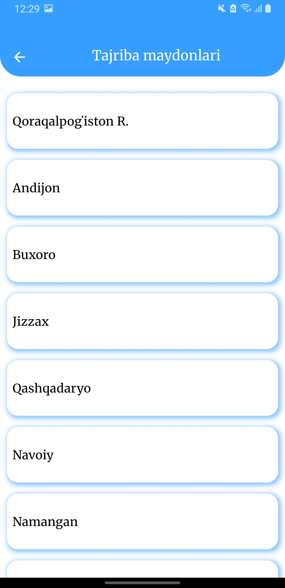
  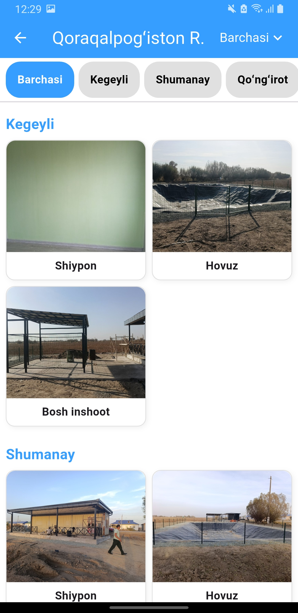
  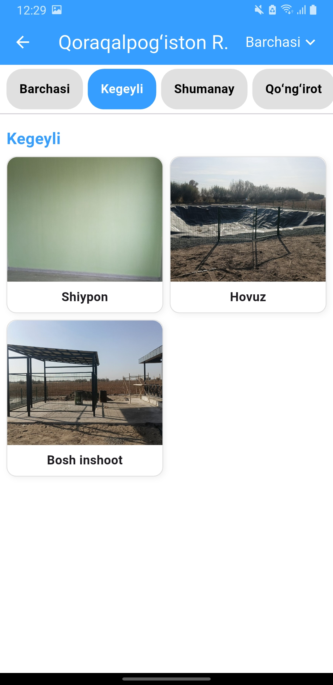
  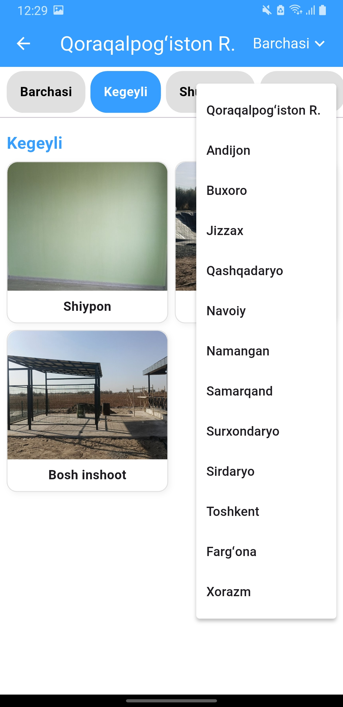
  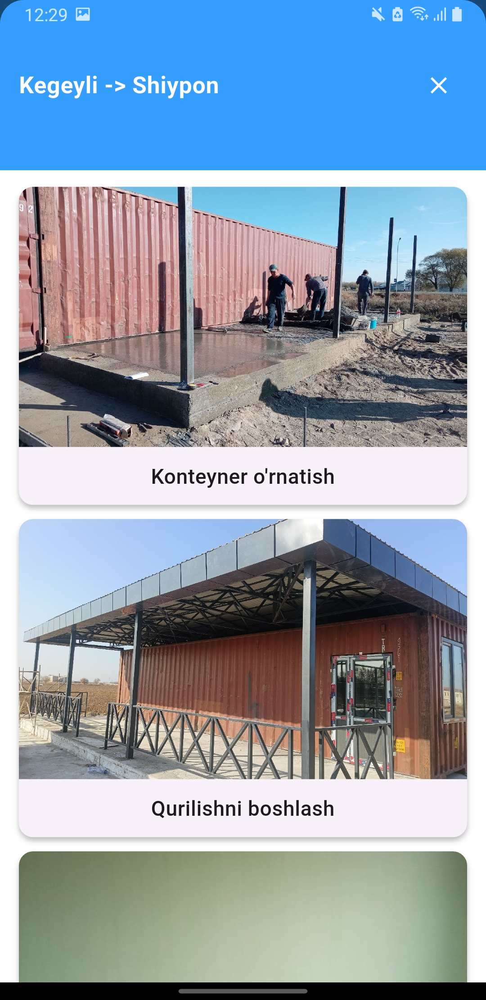
  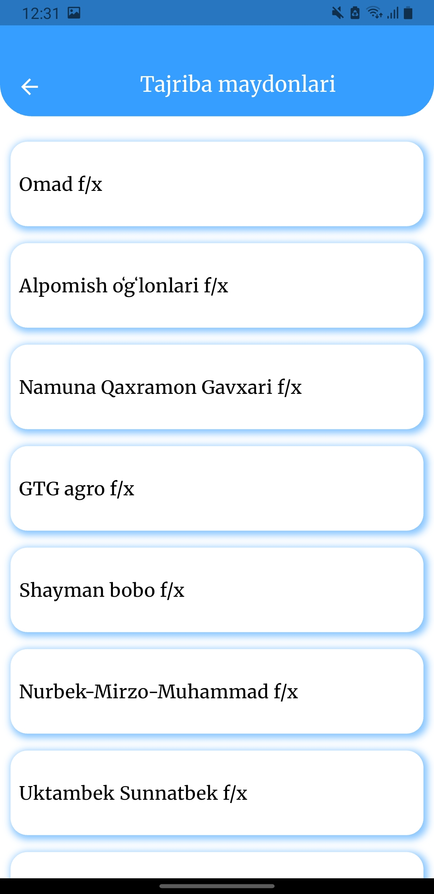
  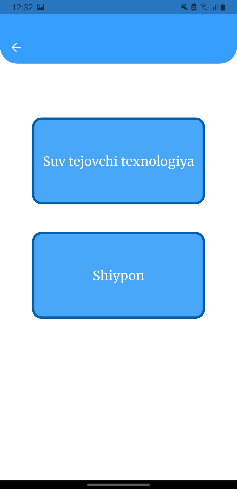
  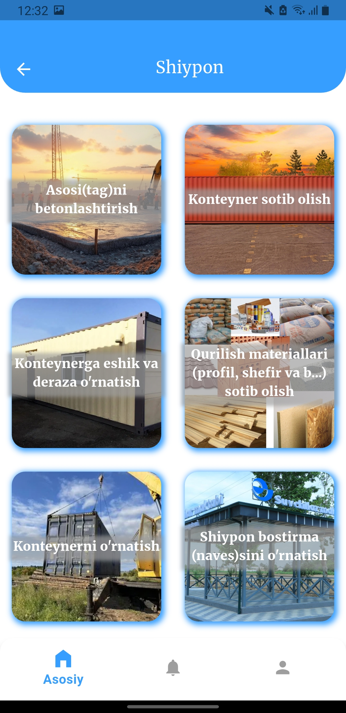
  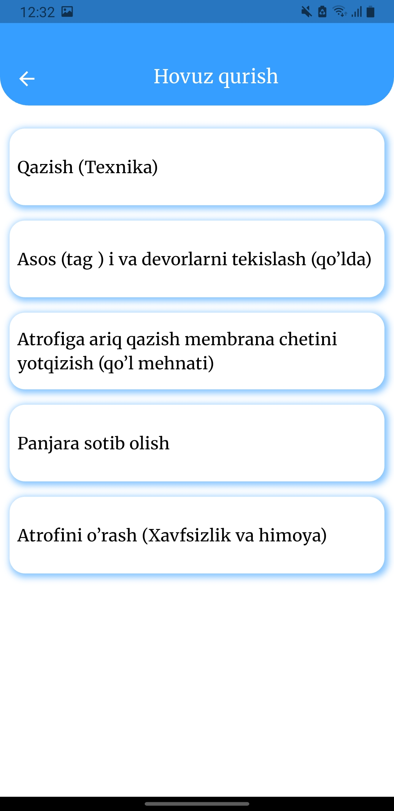
  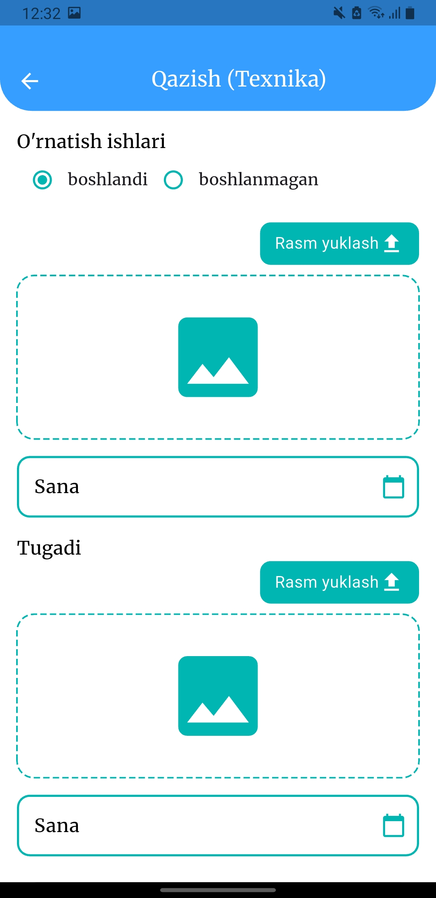
  
  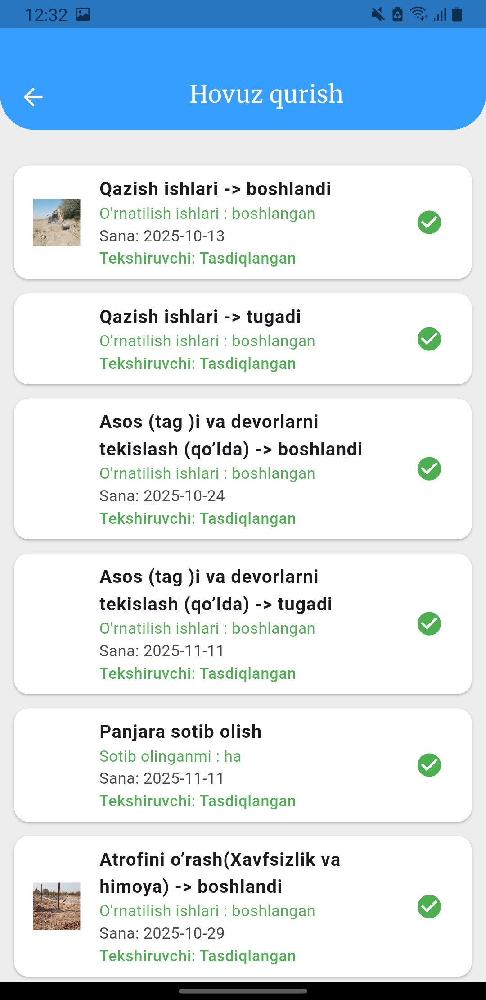
  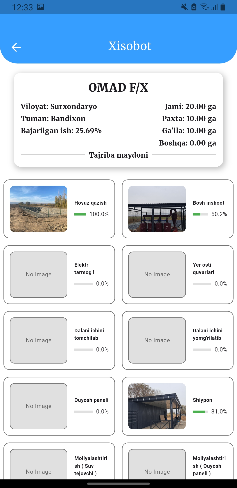
  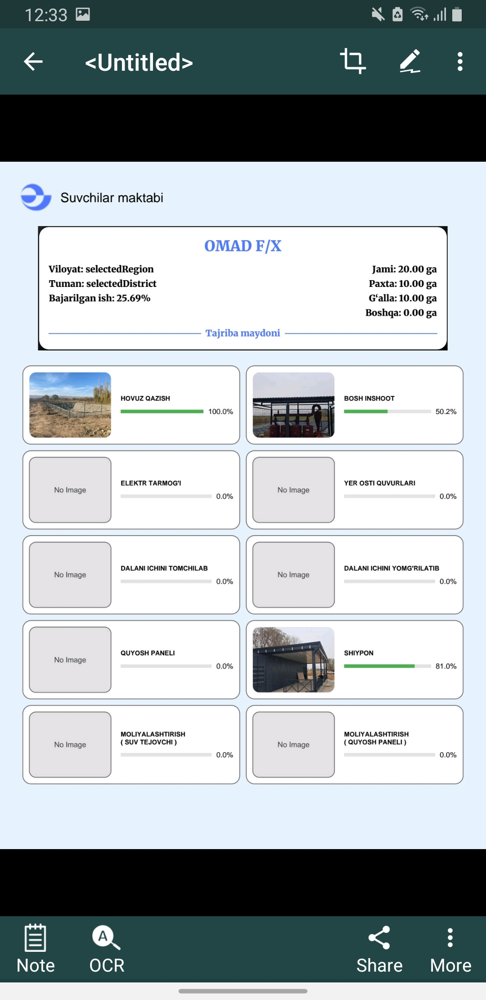

Author: [Hasanov Jahongir]

Contact: [jahonh959@gmail.com]
